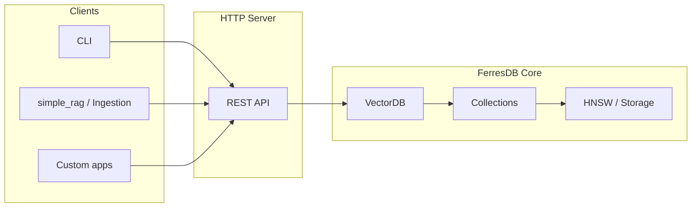

# FerresDB Core

High-performance vector search engine written in Rust, designed for semantic search, RAG (Retrieval-Augmented Generation) and recommendation systems.

## Overview

FerresDB Core is a Rust vector search engine for semantic search, RAG and recommendation. It includes an **HTTP server** with a REST API to create collections, insert points and search by similarity (vector and hybrid with BM25).

- **Vector search** with HNSW; metrics: Cosine, Euclidean, Dot Product
- **Disk persistence** (JSON-lines, WAL, crash recovery)
- **REST API** for collections, points, search and stats; Rust SDK for hybrid search
- **Use as a library** (`VectorDB`) or via server for RAG pipelines (e.g. [simple_rag](examples/simple_rag/README.md))

### Key features

- ✅ **High performance**: Search in milliseconds even with millions of vectors
- ✅ **Thread-safe**: Ready for use in multi-threaded servers
- ✅ **Persistent**: Data automatically saved to disk after each operation
- ✅ **Write-Ahead Log (WAL)**: Guarantees durability and recovery after crash
- ✅ **Periodic snapshots**: Every 1000 operations, creates a full snapshot and truncates WAL
- ✅ **Crash recovery**: Automatic recovery to a consistent state after failures
- ✅ **Extensible**: `ANNIndex` trait allows swapping the search backend
- ✅ **Type-safe**: Specific error types make handling and debugging easier

## Quick start (3 steps)

**1. Start the server**

```bash
cargo run --bin server
# or: make run   /  docker-compose up -d
```

The server runs at `http://localhost:8080` by default.

**2. Create a collection**

```bash
curl -s -X POST http://localhost:8080/api/v1/collections \
  -H "Content-Type: application/json" \
  -d '{"name":"docs","dimension":384,"distance":"Cosine"}'
```

**3. Insert points and search**

```bash
# Upsert
curl -s -X POST http://localhost:8080/api/v1/collections/docs/points \
  -H "Content-Type: application/json" \
  -d '{"points":[{"id":"doc-1","vector":[0.1,0.2,-0.1],"metadata":{"text":"Hello world"}}]}'

# Vector search (adjust vector to the collection dimension, e.g. 384)
curl -s -X POST http://localhost:8080/api/v1/collections/docs/search \
  -H "Content-Type: application/json" \
  -d '{"vector":[0.1,0.2,-0.1],"limit":5}'
```

Full endpoint and schema reference: [docs/api.md](docs/api.md).

### Connect Claude Desktop to FerresDB (MCP)

FerresDB can act as a **Model Context Protocol (MCP)** server via STDIO, allowing Claude Desktop (or other MCP clients) to use vector search, upsert and stats tools in the same process that runs the REST and gRPC APIs.

1. **Build the server with MCP support:**

   ```bash
   cargo build -p ferres-db-server --features mcp --release
   ```

2. **In Claude Desktop**, configure the MCP server to start the binary with the `--mcp` flag. For example, in `claude_desktop_config.json` (macOS: `~/Library/Application Support/Claude/claude_desktop_config.json`):

   ```json
   {
     "mcpServers": {
       "ferresdb": {
         "command": "/path/to/ferres-db-server",
         "args": ["--mcp"]
       }
     }
   }
   ```

   Use the actual binary path (e.g. `target/release/ferres-db-server` in the project directory).

3. The FerresDB process will continue serving REST and gRPC normally; MCP communication happens only via stdin/stdout. Server logs are sent to **stderr** to avoid interfering with the MCP protocol.

Available tools: `search_points`, `upsert_points`, `get_stats`. Details in [docs/api.md](docs/api.md#model-context-protocol-mcp).

---

## Use as a library (Rust)

Add to your `Cargo.toml`:

```toml
[dependencies]
ferres-db-core = { path = "crates/core" }
```

### Basic example

```rust
use ferres_db_core::{VectorDB, CollectionConfig, DistanceMetric, Point};

fn main() -> Result<(), Box<dyn std::error::Error>> {
    let mut db = VectorDB::new("./data".into())?;

    let config = CollectionConfig {
        name: "embeddings".into(),
        dimension: 384,
        distance: DistanceMetric::Cosine,
        hnsw: Default::default(),
        search_cache_size: 100,
    };
    db.create_collection(config)?;

    let points = vec![
        Point::new("doc-1", vec![0.1; 384], serde_json::json!({"text": "First document"}))?,
        Point::new("doc-2", vec![0.2; 384], serde_json::json!({"text": "Second document"}))?,
    ];
    db.upsert_points("embeddings", points)?;

    let results = db.search("embeddings", vec![0.15; 384], 5)?;
    for result in results {
        println!("ID: {}, Score: {:.4}", result.id, result.score);
    }
    Ok(())
}
```

More examples and SDK (Rust, Python, TypeScript): [docs/sdk.md](docs/sdk.md).

## Authentication

FerresDB uses API Keys to protect collection and point endpoints.

### Configure API Keys

```bash
export FERRESDB_API_KEYS="sk-dev-abc123,sk-prod-xyz789"
```

Or via `config.toml`:

```toml
api_keys = "sk-dev-abc123,sk-prod-xyz789"
```

### Generate a new API Key

```bash
echo "sk-$(openssl rand -hex 32)"
```

### Use an API Key

```bash
curl -H "Authorization: Bearer sk-dev-abc123" \
  http://localhost:3000/api/v1/collections
```

### Public endpoints (no authentication)

- `GET /health`
- `GET /metrics`
- `GET /dashboard`
- `GET /api/v1/stats/global`

### Protected endpoints (require API key)

- All `/api/v1/collections/*`
- All `/api/v1/points/*`
- `POST /api/v1/save`
- `POST /api/v1/llm/complete` (LLM proxy — Editor or Admin)
- `*/api/v1/admin/*` (Admin)

### LLM Proxy keys

The dashboard's Query Tester runs RAG flows against OpenAI / Anthropic / Gemini through a server-side proxy so provider keys never reach the browser. Configure them via env (preferred) or via the dashboard `Settings → LLM Credentials` (Admin):

```bash
export FERRESDB_OPENAI_API_KEY="sk-..."
export FERRESDB_ANTHROPIC_API_KEY="sk-ant-..."
export FERRESDB_GEMINI_API_KEY="AIza..."
```

Env vars take precedence over the DB. See `docs/api.md` (section **LLM Proxy**) for the request/response schema.

## Benchmarks

FerresDB includes comprehensive benchmarks using [Criterion.rs](https://github.com/bheisler/criterion.rs).

### Running Benchmarks

```bash
# Generate test corpus first
python tests/fixtures/generate_corpus.py

# Run benchmarks
cd crates/core
cargo bench
```

### Expected Results

**Reference hardware**: Modern CPU (Intel i7/AMD Ryzen), 16GB RAM

#### Indexing (Throughput)

| Size | Points/second | Total time |
| ---- | ------------- | ---------- |
| 1K   | ~50K–100K     | ~10–20ms   |
| 10K  | ~30K–60K      | ~150–300ms |
| 100K | ~20K–40K      | ~2.5–5s    |

#### Search (Latency)

| Metric  | P50        | P95         | P99         |
| ------- | ---------- | ----------- | ----------- |
| Latency | ~100–500μs | ~200–1000μs | ~500–2000μs |

_Note: Results vary with hardware, HNSW configuration and vector dimension._

### Viewing Results

Benchmarks generate HTML reports in `target/criterion/`. Open `target/criterion/index.html` in the browser for detailed charts.

## Roadmap

### Version 0.1.0 (Current) ✅

- [x] HNSW search engine with multiple metrics
- [x] Disk persistence (JSON-lines)
- [x] High-level API (`VectorDB`)
- [x] Data validation and error handling
- [x] Parallelization for large batches
- [x] Optional LRU cache

### Version 0.2.0 (Planned)

- [x] Write-ahead log (WAL) for better durability ✅
- [ ] Vector compression (quantization)
- [ ] Secondary indexes for metadata search
- [ ] Transaction support
- [ ] Incremental backup and restore

### Version 0.3.0 (Future)

- [ ] Automatic sharding of large collections
- [ ] Replication and high availability
- [ ] Support for multiple ANN backends (IVF, FAISS)
- [ ] Native gRPC API
- [ ] Metrics dashboard

## Documentation

- [docs/api.md](docs/api.md) — HTTP API reference (endpoints, curl, JSON schemas)
- [docs/sdk.md](docs/sdk.md) — Rust SDK and API usage in Python/TypeScript
- [docs/ARCHITECTURE.md](docs/ARCHITECTURE.md) — Overview and component diagram
- [docs/architecture.md](docs/architecture.md) — Internal architecture and data flows
- [docs/ADR/](docs/ADR/) — Architecture Decision Records (decisions in numbered files)
- [examples/simple_rag/README.md](examples/simple_rag/README.md) — Step-by-step RAG tutorial
- [tests/e2e/README.md](tests/e2e/README.md) — End-to-end tests

Rust documentation (crates): `cargo doc --open`

## Architecture (high-level)



Repository structure:

```
ferres-db-core/
├── crates/
│   ├── core/          # Vector engine: points, collections, HNSW, storage, WAL
│   ├── server/        # HTTP server (REST)
│   └── sdk-rust/      # Rust SDK (HTTP client, hybrid search)
├── docs/
│   ├── api.md         # API reference
│   ├── sdk.md         # SDK and clients guide
│   ├── architecture.md
│   └── decisions.md
├── examples/          # Ingestion, simple_rag
└── tests/
```

### Core Modules

| Module          | Responsibility                                   |
| --------------- | ------------------------------------------------ |
| `point.rs`      | `Point` struct — f32 vector + ID + JSON metadata |
| `collection.rs` | `Collection` — manages points and ANN index      |
| `search.rs`     | `ANNIndex` trait + HNSW implementation           |
| `storage.rs`    | Disk persistence via JSON-lines                  |
| `error.rs`      | Error types with `thiserror`                     |
| `lib.rs`        | Main `VectorDB` API + re-exports                 |

## Docker

### Build and Run with Docker

The project includes an optimized multi-stage Dockerfile and docker-compose.yml for easy deployment.

#### Using Makefile (recommended)

```bash
# Build Docker image
make docker-build

# Run container
make docker-run

# View logs
make docker-logs

# Stop container
make docker-stop

# Clean images and volumes
make docker-clean
```

#### Using Docker Compose directly

```bash
# Build and start
docker-compose up -d

# View logs
docker-compose logs -f

# Stop
docker-compose down

# Stop and remove volumes
docker-compose down -v
```

#### Environment Variables

The server can be configured via environment variables:

- `HOST`: Bind host (default: `0.0.0.0`)
- `PORT`: Server port (default: `8080`)
- `STORAGE_PATH`: Path for persistent data (default: `/data`)
- `LOG_LEVEL`: Log level (default: `info`)

#### Health Check

The container includes an automatic health check on the `/health` endpoint:

```bash
# Check container health
curl http://localhost:8080/health
```

#### Volumes

Data is persisted in the `ferres-data` volume. For backup:

```bash
# Backup the volume
docker run --rm -v ferres-db-core_ferres-data:/data -v $(pwd):/backup \
  debian:bookworm-slim tar czf /backup/ferres-backup.tar.gz /data
```

For the full Docker setup guide (development, production, Docker Hub publishing, troubleshooting), see [DOCKER.md](DOCKER.md).

## Observability (Distributed Tracing)

FerresDB supports distributed tracing via **OpenTelemetry** (OTLP) to monitor vector searches end-to-end. When enabled, each HTTP request generates hierarchical spans with rich attributes (collection, dimension, latency per phase, etc.), exported to backends like Jaeger, Grafana Tempo or any OTLP collector.

### Enabling OpenTelemetry

Build with the `otel` feature:

```bash
cargo build --release --features otel
```

### Environment Variables

| Variable                      | Default                 | Description                         |
| ----------------------------- | ----------------------- | ----------------------------------- |
| `OTEL_EXPORTER_OTLP_ENDPOINT` | `http://localhost:4317` | gRPC endpoint of the OTLP collector |

### Example with Jaeger

```bash
# 1. Start Jaeger (UI at http://localhost:16686)
docker run -d --name jaeger \
  -p 16686:16686 \
  -p 4317:4317 \
  jaegertracing/all-in-one:latest

# 2. Start FerresDB with tracing
OTEL_EXPORTER_OTLP_ENDPOINT=http://localhost:4317 \
  cargo run --release --features otel

# 3. Run a search and visualize the trace in Jaeger
curl -X POST http://localhost:8080/api/v1/collections/docs/search \
  -H "Content-Type: application/json" \
  -d '{"vector":[0.1,0.2,-0.1],"limit":5}'
```

### Span Hierarchy

Each vector search generates the following span tree:

```
http_request
  └── search_points (db.operation=vector_search, db.collection=..., db.results.count=...)
        ├── validate_query
        ├── collection.search (points=N, dimension=D)
        │     └── hnsw.search (candidates=N, ef=E, tombstones=T)
        └── hydrate_results
```

### OTel Span Attributes

| Attribute                | Span          | Description                              |
| ------------------------ | ------------- | ---------------------------------------- |
| `db.collection`          | search_points | Collection name                          |
| `db.operation`           | search_points | Type: `vector_search` or `hybrid_search` |
| `db.vector.dimension`    | search_points | Vector dimension                         |
| `db.results.count`       | search_points | Number of results returned               |
| `db.duration.search_ms`  | search_points | HNSW search time (ms)                    |
| `db.duration.hydrate_ms` | search_points | Hydration time (ms)                      |
| `db.index.type`          | search_points | Index type (`hnsw`)                      |
| `db.index.ef_search`     | search_points | ef_search parameter used                 |

### Context Propagation (W3C Trace Context)

FerresDB automatically propagates trace context via W3C `traceparent` and `tracestate` headers. When receiving a request with these headers, the HTTP span is linked to the caller's trace. The `x-trace-id` header is included in the response for easier debugging.

### Without OTel (default)

Without the `otel` feature, FerresDB works normally with structured logging (JSON to file, text to console) with no distributed tracing overhead.

## Build and Development

### Build

```bash
# Development build
cargo build

# Optimized build (release)
cargo build --release

# Build using Makefile
make build

# Run locally
make run

# Tests
make test
# or
cargo test

# Documentation
cargo doc --open
```

## Contributing

Contributions are welcome! See **[CONTRIBUTING.md](CONTRIBUTING.md)** for development environment, testing, code standards and PR process.

## License

Licensed under either of

- Apache License, Version 2.0 ([LICENSE-APACHE](LICENSE-APACHE) or http://www.apache.org/licenses/LICENSE-2.0)
- MIT license ([LICENSE-MIT](LICENSE-MIT) or http://opensource.org/licenses/MIT)

at your option.

### Contribution

Unless you explicitly state otherwise, any contribution intentionally submitted
for inclusion in the work by you, as defined in the Apache-2.0 license, shall be
dual licensed as above, without any additional terms or conditions.

All contributions must be signed off (DCO). See [CONTRIBUTING.md](CONTRIBUTING.md#developer-certificate-of-origin-dco)
for details.

## Acknowledgements

- [hnsw_rs](https://github.com/guillaume-be/hnsw_rs) — HNSW library in Rust
- [Criterion.rs](https://github.com/bheisler/criterion.rs) — Benchmarking framework

