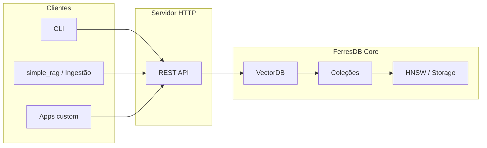

# FerresDB Core

Motor de busca vetorial de alta performance escrito em Rust, projetado para aplicações de busca semântica, RAG (Retrieval-Augmented Generation) e sistemas de recomendação.

## Visão geral

O FerresDB Core é um motor de busca vetorial em Rust para busca semântica, RAG e recomendação. Inclui **servidor HTTP** com API REST para criar coleções, inserir pontos e buscar por similaridade (vetorial e híbrida com BM25).

- **Busca vetorial** com HNSW; métricas: Cosine, Euclidean, Dot Product
- **Persistência** em disco (JSON-lines, WAL, crash recovery)
- **API REST** para coleções, pontos, busca e stats; SDK Rust para busca híbrida
- **Uso como biblioteca** (`VectorDB`) ou via servidor para pipelines RAG (ex.: [simple_rag](examples/simple_rag/README.md))

### Características principais

- ✅ **Alta performance**: Busca em milissegundos mesmo com milhões de vetores
- ✅ **Thread-safe**: Pronto para uso em servidores multi-threaded
- ✅ **Persistente**: Dados salvos automaticamente em disco após cada operação
- ✅ **Write-Ahead Log (WAL)**: Garante durabilidade e recuperação após crash
- ✅ **Snapshots periódicos**: A cada 1000 operações, cria snapshot completo e trunca WAL
- ✅ **Crash recovery**: Recuperação automática do estado consistente após falhas
- ✅ **Extensível**: Trait `ANNIndex` permite trocar o backend de busca
- ✅ **Type-safe**: Tipos de erro específicos facilitam tratamento e debugging

## Quick start (3 passos)

**1. Subir o servidor**

```bash
cargo run --bin server
# ou: make run   /  docker-compose up -d
```

Por padrão o servidor fica em `http://localhost:8080`.

**2. Criar uma coleção**

```bash
curl -s -X POST http://localhost:8080/api/v1/collections \
  -H "Content-Type: application/json" \
  -d '{"name":"docs","dimension":384,"distance":"Cosine"}'
```

**3. Inserir pontos e buscar**

```bash
# Upsert
curl -s -X POST http://localhost:8080/api/v1/collections/docs/points \
  -H "Content-Type: application/json" \
  -d '{"points":[{"id":"doc-1","vector":[0.1,0.2,-0.1],"metadata":{"text":"Hello world"}}]}'

# Busca vetorial (ajuste o vetor para a dimensão da coleção, ex.: 384)
curl -s -X POST http://localhost:8080/api/v1/collections/docs/search \
  -H "Content-Type: application/json" \
  -d '{"vector":[0.1,0.2,-0.1],"limit":5}'
```

Referência completa dos endpoints e schemas: [docs/api.md](docs/api.md).

---

## Uso como biblioteca (Rust)

Adicione ao seu `Cargo.toml`:

```toml
[dependencies]
ferres-db-core = { path = "crates/core" }
```

### Exemplo básico

```rust
use ferres_db_core::{VectorDB, CollectionConfig, DistanceMetric, Point};

fn main() -> Result<(), Box<dyn std::error::Error>> {
    let mut db = VectorDB::new("./data".into())?;

    let config = CollectionConfig {
        name: "embeddings".into(),
        dimension: 384,
        distance: DistanceMetric::Cosine,
        hnsw: Default::default(),
        search_cache_size: 100,
    };
    db.create_collection(config)?;

    let points = vec![
        Point::new("doc-1", vec![0.1; 384], serde_json::json!({"text": "Primeiro documento"}))?,
        Point::new("doc-2", vec![0.2; 384], serde_json::json!({"text": "Segundo documento"}))?,
    ];
    db.upsert_points("embeddings", points)?;

    let results = db.search("embeddings", vec![0.15; 384], 5)?;
    for result in results {
        println!("ID: {}, Score: {:.4}", result.id, result.score);
    }
    Ok(())
}
```

Mais exemplos e SDK (Rust, Python, TypeScript): [docs/sdk.md](docs/sdk.md).

## Autenticação

O FerresDB usa API Keys para proteger endpoints de collections e points.

### Configurar API Keys

```bash
export FERRESDB_API_KEYS="sk-dev-abc123,sk-prod-xyz789"
```

Ou via `config.toml`:

```toml
api_keys = "sk-dev-abc123,sk-prod-xyz789"
```

### Gerar nova API Key

```bash
echo "sk-$(openssl rand -hex 32)"
```

### Usar API Key

```bash
curl -H "Authorization: Bearer sk-dev-abc123" \
  http://localhost:3000/api/v1/collections
```

### Endpoints públicos (sem autenticação)

- `GET /health`
- `GET /metrics`
- `GET /dashboard`
- `GET /api/v1/stats/global`

### Endpoints protegidos (requerem API key)

- Todos de `/api/v1/collections/*`
- Todos de `/api/v1/points/*`
- `POST /api/v1/save`

## 📊 Benchmarks

O FerresDB inclui benchmarks completos usando [Criterion.rs](https://github.com/bheisler/criterion.rs).

### Executando Benchmarks

```bash
# Gere os corpus de teste primeiro
python tests/fixtures/generate_corpus.py

# Execute os benchmarks
cd crates/core
cargo bench
```

### Resultados Esperados

**Hardware de referência**: CPU moderna (Intel i7/AMD Ryzen), 16GB RAM

#### Indexação (Throughput)

| Tamanho | Pontos/segundo | Tempo total |
| ------- | -------------- | ----------- |
| 1K      | ~50K-100K      | ~10-20ms    |
| 10K     | ~30K-60K       | ~150-300ms  |
| 100K    | ~20K-40K       | ~2.5-5s     |

#### Busca (Latência)

| Métrica  | P50        | P95         | P99         |
| -------- | ---------- | ----------- | ----------- |
| Latência | ~100-500μs | ~200-1000μs | ~500-2000μs |

_Nota: Resultados variam com hardware, configuração HNSW e dimensão dos vetores._

### Visualizando Resultados

Os benchmarks geram relatórios HTML em `target/criterion/`. Abra `target/criterion/index.html` no navegador para gráficos detalhados.

## 🗺️ Roadmap

### Versão 0.1.0 (Atual) ✅

- [x] Motor de busca HNSW com múltiplas métricas
- [x] Persistência em disco (JSON-lines)
- [x] API de alto nível (`VectorDB`)
- [x] Validação de dados e tratamento de erros
- [x] Paralelização para batches grandes
- [x] Cache LRU opcional

### Versão 0.2.0 (Planejado)

- [x] Write-ahead log (WAL) para melhor durabilidade ✅
- [ ] Compressão de vetores (quantização)
- [ ] Índices secundários para busca por metadados
- [ ] Suporte a transações
- [ ] Backup e restore incrementais

### Versão 0.3.0 (Futuro)

- [ ] Sharding automático de coleções grandes
- [ ] Replicação e alta disponibilidade
- [ ] Suporte a múltiplos backends ANN (IVF, FAISS)
- [ ] API gRPC nativa
- [ ] Dashboard de métricas

## Documentação

- [docs/api.md](docs/api.md) — Referência da API HTTP (endpoints, curl, schemas JSON)
- [docs/sdk.md](docs/sdk.md) — SDK Rust e uso da API em Python/TypeScript
- [docs/ARCHITECTURE.md](docs/ARCHITECTURE.md) — Visão geral e diagrama de componentes
- [docs/architecture.md](docs/architecture.md) — Arquitetura interna e fluxos de dados
- [docs/ADR/](docs/ADR/) — Architecture Decision Records (decisões em arquivos numerados)
- [examples/simple_rag/README.md](examples/simple_rag/README.md) — Tutorial RAG passo a passo
- [tests/e2e/README.md](tests/e2e/README.md) — Testes end-to-end

Documentação Rust (crates): `cargo doc --open`

## Arquitetura (high-level)



Estrutura do repositório:

```
ferres-db-core/
├── crates/
│   ├── core/          # Motor vetorial: pontos, coleções, HNSW, storage, WAL
│   ├── server/        # Servidor HTTP (REST)
│   └── sdk-rust/      # SDK Rust (cliente HTTP, busca híbrida)
├── docs/
│   ├── api.md         # Referência da API
│   ├── sdk.md         # Guia SDK e clientes
│   ├── architecture.md
│   └── decisions.md
├── examples/          # Ingestão, simple_rag
└── tests/
```

### Módulos do Core

| Módulo          | Responsabilidade                                   |
| --------------- | -------------------------------------------------- |
| `point.rs`      | Estrutura `Point` — vetor f32 + ID + metadata JSON |
| `collection.rs` | `Collection` — gerencia pontos e índice ANN        |
| `search.rs`     | Trait `ANNIndex` + implementação HNSW              |
| `storage.rs`    | Persistência em disco via JSON-lines               |
| `error.rs`      | Tipos de erro com `thiserror`                      |
| `lib.rs`        | API principal `VectorDB` + re-exports              |

## 🐳 Docker

### Build e Execução com Docker

O projeto inclui um Dockerfile multi-stage otimizado e docker-compose.yml para facilitar o deploy.

#### Usando Makefile (recomendado)

```bash
# Construir imagem Docker
make docker-build

# Executar container
make docker-run

# Ver logs
make docker-logs

# Parar container
make docker-stop

# Limpar imagens e volumes
make docker-clean
```

#### Usando Docker Compose diretamente

```bash
# Build e start
docker-compose up -d

# Ver logs
docker-compose logs -f

# Parar
docker-compose down

# Parar e remover volumes
docker-compose down -v
```

#### Variáveis de Ambiente

O servidor pode ser configurado via variáveis de ambiente:

- `HOST`: Host para bind (padrão: `0.0.0.0`)
- `PORT`: Porta do servidor (padrão: `8080`)
- `STORAGE_PATH`: Caminho para dados persistentes (padrão: `/data`)
- `LOG_LEVEL`: Nível de log (padrão: `info`)

#### Health Check

O container inclui health check automático no endpoint `/health`:

```bash
# Verificar saúde do container
curl http://localhost:8080/health
```

#### Volumes

Os dados são persistidos no volume `ferres-data`. Para backup:

```bash
# Backup do volume
docker run --rm -v ferres-db-core_ferres-data:/data -v $(pwd):/backup \
  debian:bookworm-slim tar czf /backup/ferres-backup.tar.gz /data
```

## 🔧 Build e Desenvolvimento

### Build

```bash
# Build de desenvolvimento
cargo build

# Build otimizado (release)
cargo build --release

# Build usando Makefile
make build

# Executar localmente
make run

# Testes
make test
# ou
cargo test

# Documentação
cargo doc --open
```

### CLI

O FerresDB inclui uma CLI completa. Veja [README.md](README.md#cli-interface-de-linha-de-comando) para detalhes.

## 🤝 Contribuindo

Contribuições são bem-vindas! Consulte o **[CONTRIBUTING.md](CONTRIBUTING.md)** para ambiente de desenvolvimento, testes, padrões de código e processo de PR.

## 📄 Licença

MIT

## 🙏 Agradecimentos

- [hnsw_rs](https://github.com/guillaume-be/hnsw_rs) - Biblioteca HNSW em Rust
- [Criterion.rs](https://github.com/bheisler/criterion.rs) - Framework de benchmarks
