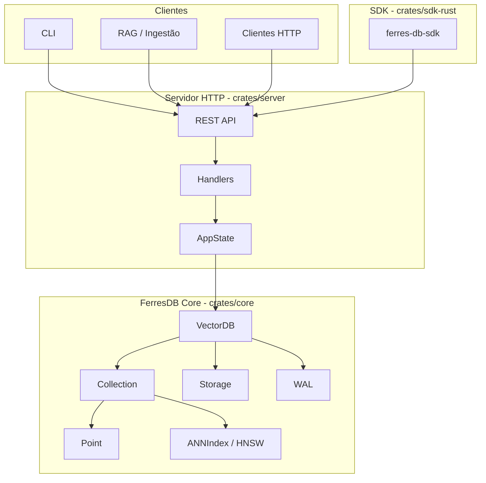

# Arquitetura — Visão Geral

Documento de entrada para a arquitetura do FerresDB Core. Para detalhes de componentes, fluxos e decisões, veja [architecture.md](architecture.md).

## Diagrama de Componentes



## Camadas

| Camada   | Crates     | Responsabilidade                         |
| -------- | ---------- | ---------------------------------------- |
| **API**  | `server`   | REST (Axum), handlers, métricas, health  |
| **Core** | `core`     | VectorDB, Collection, HNSW, Storage, WAL |
| **SDK**  | `sdk-rust` | Cliente Rust (HTTP, busca híbrida)       |

## Fluxo High-Level


## Documentação Detalhada

- **[architecture.md](architecture.md)** — Componentes (Point, Collection, ANNIndex, Storage), fluxos (Insert, Search, Delete, Load), decisões de design, thread-safety, performance e extensibilidade.
- **[api.md](api.md)** — Referência dos endpoints REST.
- **[ADR/](ADR/)** — Architecture Decision Records (decisões em arquivos numerados).

## Estrutura do Repositório

```
ferres-db-core/
├── crates/
│   ├── core/       # Motor: VectorDB, Collection, HNSW, Storage, WAL, BM25
│   ├── server/     # Servidor HTTP (Axum), handlers, métricas
│   └── sdk-rust/   # SDK Rust (cliente HTTP)
├── docs/
│   ├── ARCHITECTURE.md   # Este arquivo (visão + diagramas)
│   ├── architecture.md  # Documentação detalhada
│   ├── ADR/              # Decision records
│   ├── api.md
│   └── sdk.md
├── examples/       # Ingestão, simple_rag
├── tests/          # E2E, fixtures
└── CONTRIBUTING.md # Guia de contribuição
```
