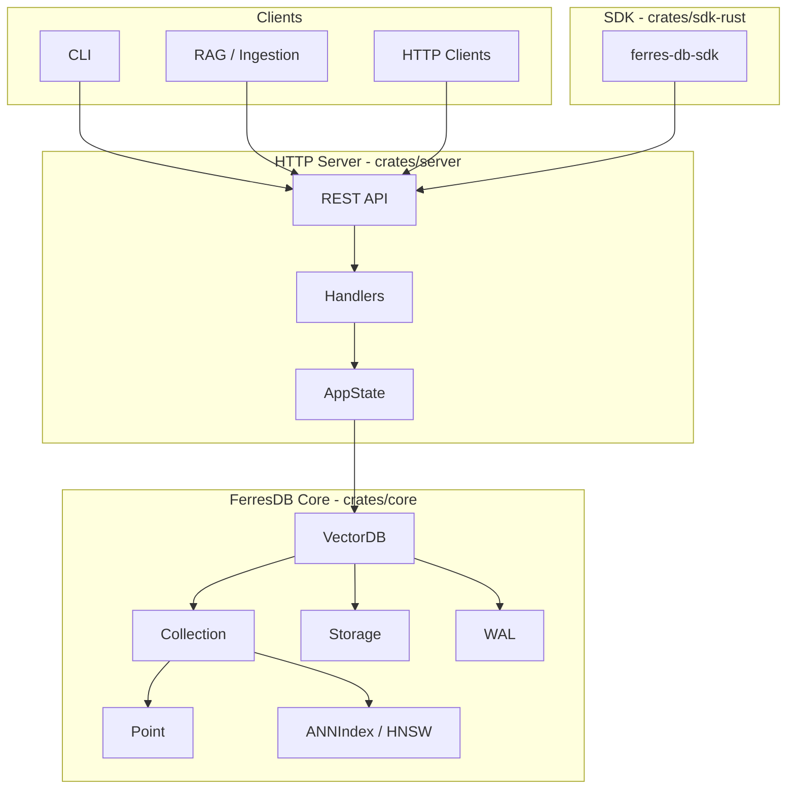
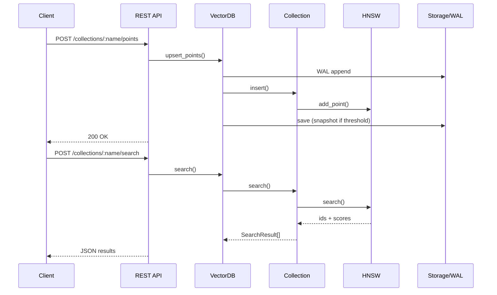

# Architecture — Overview

Entry document for the FerresDB Core architecture. For component details, flows and decisions, see [architecture.md](architecture.md).

## Component Diagram



## Layers

| Layer    | Crates     | Responsibility                            |
| -------- | ---------- | ----------------------------------------- |
| **API**  | `server`   | REST (Axum), handlers, metrics, health    |
| **Core** | `core`     | VectorDB, Collection, HNSW, Storage, WAL  |
| **SDK**  | `sdk-rust` | Rust client (HTTP, hybrid search)         |

## High-Level Flow



## Detailed Documentation

- **[architecture.md](architecture.md)** — Components (Point, Collection, ANNIndex, Storage), flows (Insert, Search, Delete, Load), design decisions, thread-safety, performance and extensibility.
- **[api.md](api.md)** — REST endpoint reference.
- **[ADR/](ADR/)** — Architecture Decision Records (decisions in numbered files).

## Repository Structure

```
ferres-db-core/
├── crates/
│   ├── core/       # Engine: VectorDB, Collection, HNSW, Storage, WAL, BM25
│   ├── server/     # HTTP server (Axum), handlers, metrics
│   └── sdk-rust/   # Rust SDK (HTTP client)
├── docs/
│   ├── ARCHITECTURE.md   # This file (overview + diagrams)
│   ├── architecture.md  # Detailed documentation
│   ├── ADR/              # Decision records
│   ├── api.md
│   └── sdk.md
├── examples/       # Ingestion, simple_rag
├── tests/          # E2E, fixtures
└── CONTRIBUTING.md # Contribution guide
```
